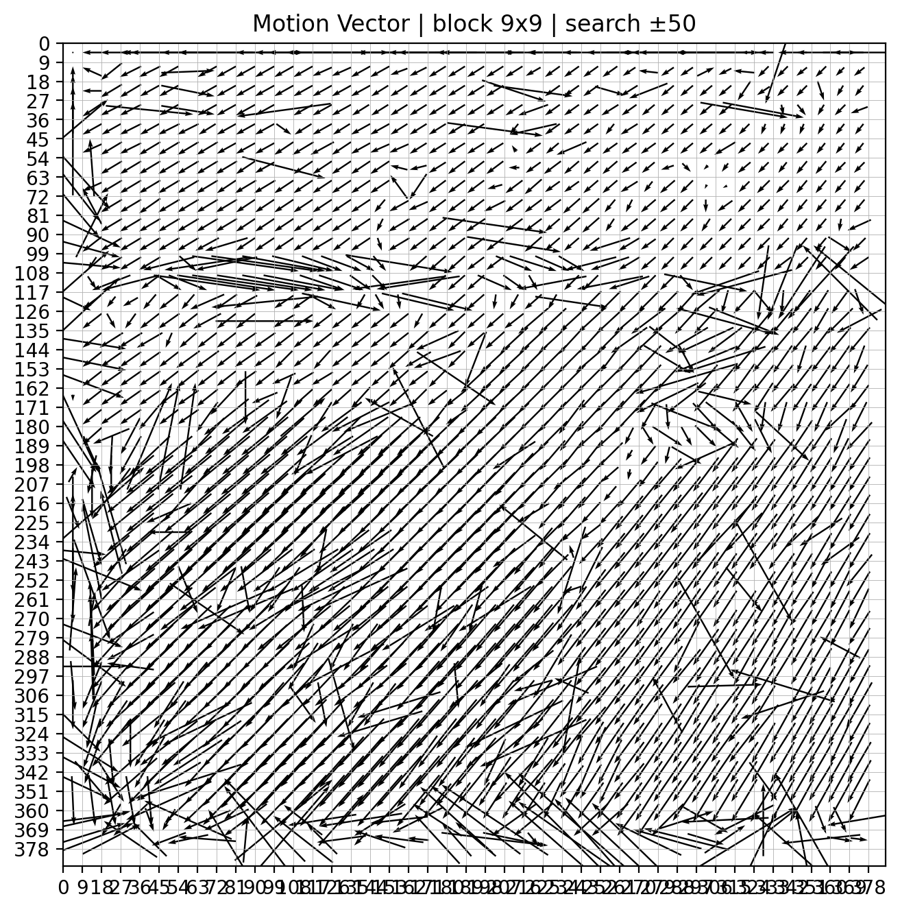
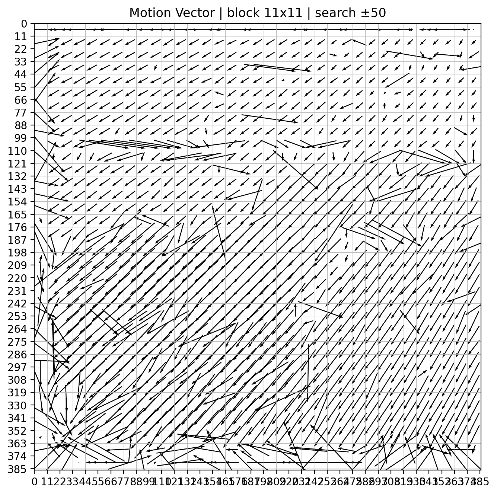
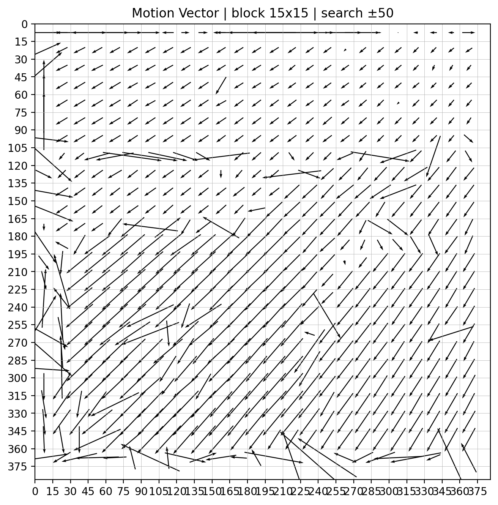
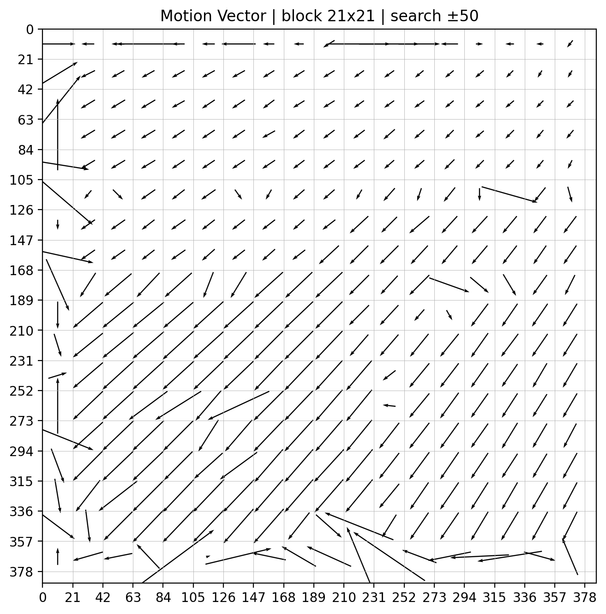
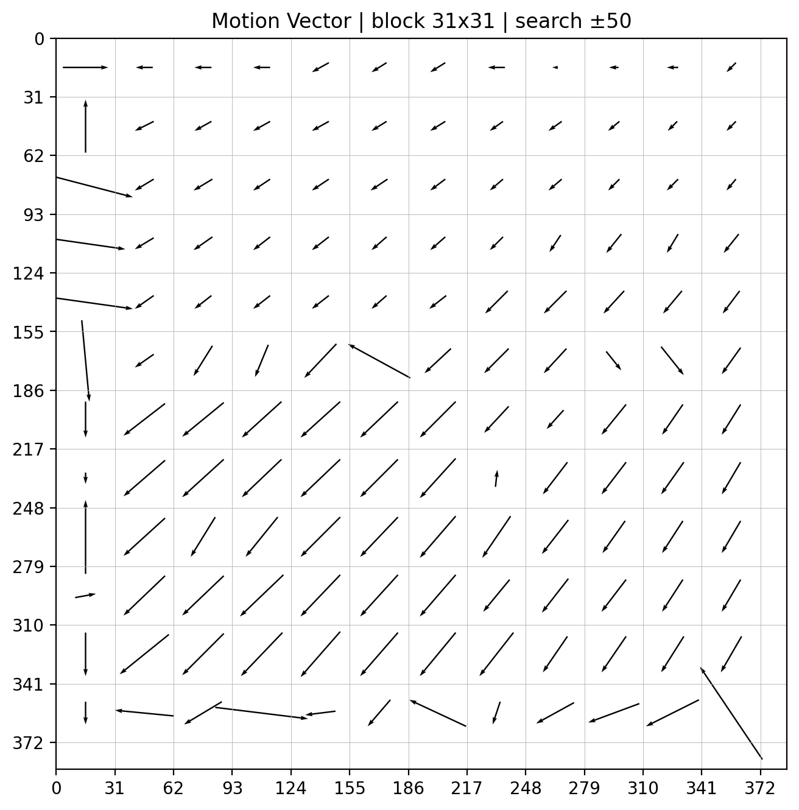

# Homework 1 – Image Matching (Detecting Motion Vectors)

---

## Usage

```bash
cd HW
jupyter notebook Image_Matching.ipynb
```

```

Run all cells to generate motion vector visualizations.

All output images are saved in the `outputs/` folder.

---

## Description

This homework detects **motion vectors** between two consecutive images:
`trucka.bmp` and `truckb.bmp`.

The task is to use **block-based image matching** to estimate motion
from `trucka.bmp` to `truckb.bmp`.

---

## Method

- **Reference image:** `trucka.bmp`
- **Target image:** `truckb.bmp`
- **Block sizes:**
  - 9 × 9
  - 11 × 11
  - 15 × 15
  - 21 × 21
  - 31 × 31

- **Search range:** ±50 pixels
- **Matching metric:** Sum of Squared Differences (SSD)
- **Sampling:** Non-overlapping blocks (stride = block size)
- **Visualization:** Raw motion vectors `(dx, dy)` (no normalization)

---

## Image Information

- **Image resolution:** 386 × 386
- **Grayscale image**
- **Leading header:** 216 bytes (already handled)

---

## Results

### Block Size: 9 × 9



### Block Size: 11 × 11



### Block Size: 15 × 15



### Block Size: 21 × 21



### Block Size: 31 × 31



---

## Observations

- Smaller block sizes capture finer local motion but are more sensitive to noise.
- Larger block sizes produce smoother and more stable motion fields.
- Block size has a significant impact on motion estimation quality.

---

## Dependencies

- Python 3.9+
- OpenCV
- NumPy
- Matplotlib
- Jupyter Notebook

```
